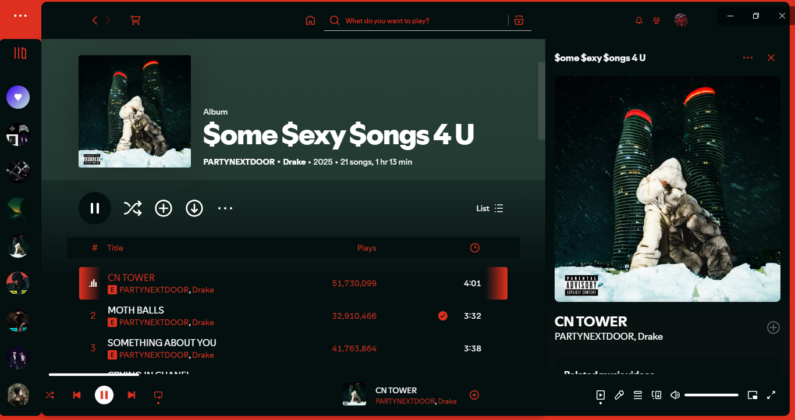
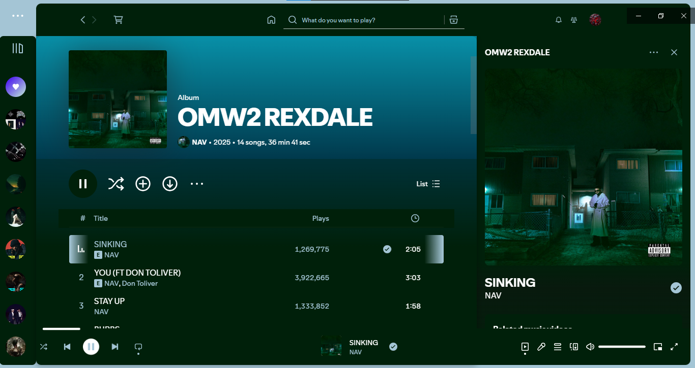
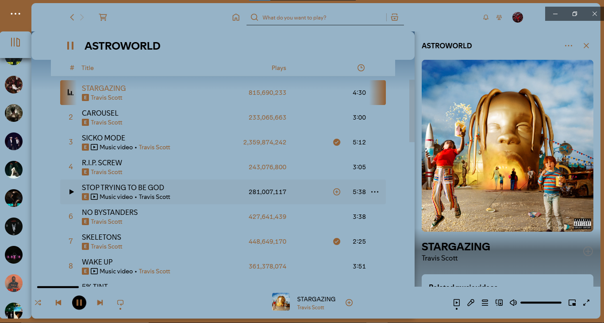

# Dynamic Album-Themed UI for Spicetify

A visual extension for Spicetify that automatically adjusts your theme's colors based on the currently playing album's artwork.

---

## What It Does

- Detects the colors of the current album cover art 
- Applies them to the theme as primary/secondary colors
- Makes your music player visually adapt to each track
- Overrides the fullscreen ui with a custom one that uses the features from this extension(experimental)

---

## Supported Themes

- **Officially supported Theme:** Dribbblish
- ⚠️Other themes (including default) have **not been tested**
- Results may vary or not apply correctly outside Dribbblish

---

## Installation

> As of now, the extension is not available on the marketplace

### Install supported theme (skip if installed already)
- it's strongly reccomended the use of a supported theme - [Supported Themes](#supported-themes)

### 1 Download  the extension file
- DynamicCoverTheme.js
### 2 Insert the file into the extension folder
- appdata/roaming/spicetify/extensions
### 3 Powershell configurate and apply
- spicetify config extensions DynamicCoverTheme.js
- spicetify apply

---

## Troubleshooting

> ⚠️ This extension may still not be optimized and errors could occur
> 
> if the theme isnt loading most of the time is due to issues with the server performance: wait 10 or 15 seconds and reload or restart spotify
> 
> if you notice repeating warnings in the console re-apply the extension with "spicetify apply"

---

## Performance

- Lightweight and reactive — updates only when the song changes
- Dominant color extraction is done using a custom algorithm hosted externally (Not built-in album color)
- Network Scaling for multiple users is basic and hasnt been optimized

---

## Privacy

- No user data is collected or stored
- Requests are made only for album artwork color extraction
- External API used is secure-hosted and non-tracking

---

# Showcase
|                              |                              |
|------------------------------|------------------------------|
|  |  |
|  |  |

---

## Availability

Currently in testing. If you're interested to contribute or have any questions about the extension, feel free to reach out (@albeedev on discord or in the spicetify discord server).
